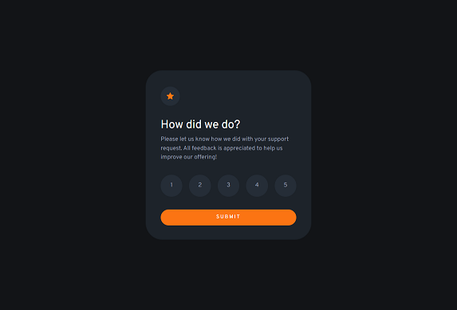

# Frontend Mentor - Interactive rating component solution

This is a solution to the [Interactive rating component challenge on Frontend Mentor](https://www.frontendmentor.io/challenges/interactive-rating-component-koxpeBUmI). Frontend Mentor challenges help you improve your coding skills by building realistic projects.

## Table of contents

- [Overview](#overview)
  - [The challenge](#the-challenge)
  - [Screenshot](#screenshot)
  - [Links](#links)
- [My process](#my-process)
  - [Built with](#built-with)
  - [What I learned](#what-i-learned)
- [Author](#author)
- [Acknowledgments](#acknowledgments)

## Overview

### The challenge

Users should be able to:

- View the optimal layout for the app depending on their device's screen size
- See hover states for all interactive elements on the page
- Select and submit a number rating
- See the "Thank you" card state after submitting a rating

### Screenshot

### Links

- Solution URL: [https://github.com/mays21/interactive-rating-component](https://github.com/mays21/interactive-rating-component)
- Live Site URL: [https://mays21.github.io/interactive-rating-component/](https://mays21.github.io/interactive-rating-component/)

## My process

### Built with

- Semantic HTML5 markup
- SASS & Bootstrap5
- JQuery
- Mobile-first workflow

### What I learned

- How to set up raw Bootstrap and compile
- How to use JQuery
- radio box select button
- rounded icon

## Author

- Frontend Mentor - [@mays21](https://www.frontendmentor.io/profile/mays21)

## Acknowledgments

Bootstrap のカスタマイズ方法

1. npm で Bootstrap をローカルにインストールする
2. \_custom.scss を作成し、variable を上書きする
3. style.scss \_custom、Bootstrap の順にインポートする
4. コンパイルする
